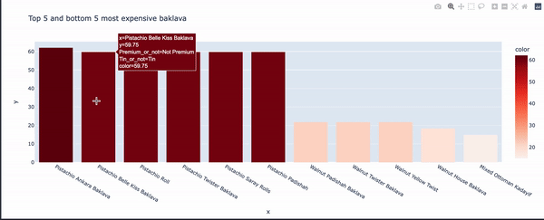
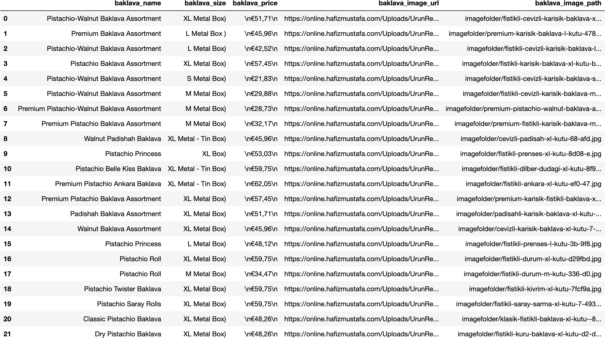
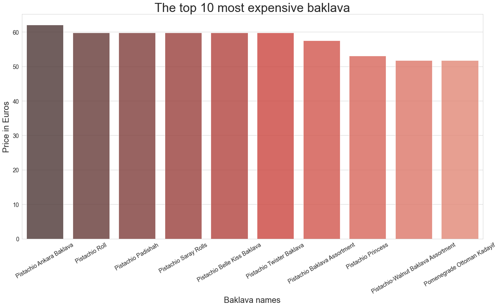
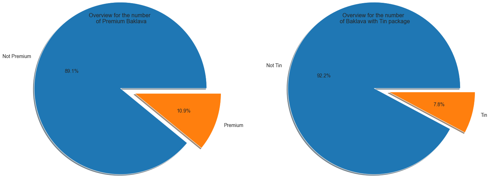
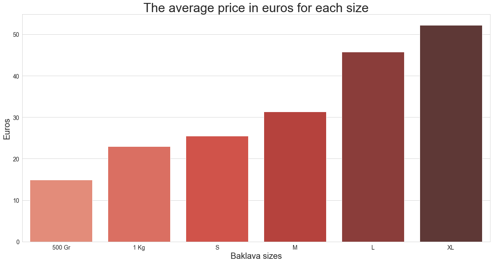
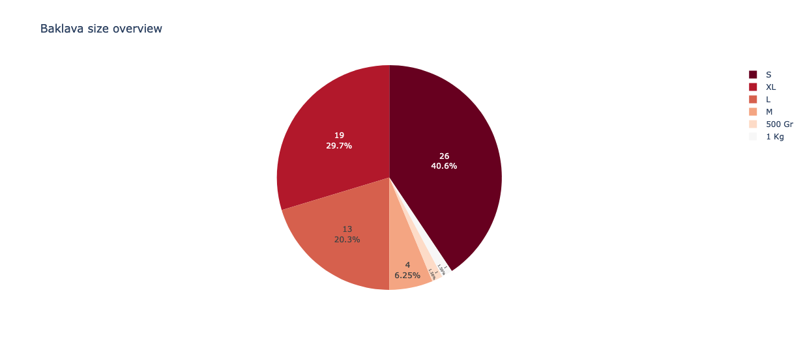
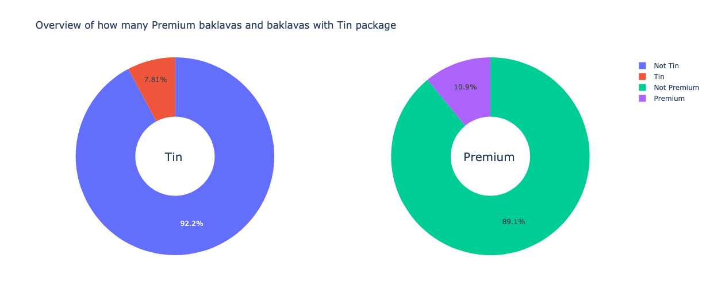

`Python`, `Webscraping`,`Pandas`, `Plotly`, `Data Cleaning`, `Data Visualizations`, `Basic Statistics`, `Interactive plots` 

# Webscraping project - With data cleaning and visualization

This personal project is made to understand and learn how data can be scraped from a website. Baklava is a very delicious turkish dessert, and I really like 
baklava. I therefore decided to webscrape [Hafız Mustafa](https://online.hafizmustafa.com/baklava-en), which is a baklava brand, which in my opinion makes 
the best baklava. 

The following three images are respectively:

(1) A webscraped baklava image (the most expensive one) from the website.
\
(2) The sub-dataset (the whole dataset contains 64 rows), which I have created by scraping data from the website and cleaning it with Pandas.
\
(3) An interactive visualization made with Plotly.

<br>
<p align="center">  </p>
<br>

<br>
<p align="center">  </p>
<br>

<br>
<p align="center">  </p>
<br>

## 1.) Webscraping
So we start first with scraping the data from this [website](https://online.hafizmustafa.com/baklava-en). We are doing so, by first importing relevant libraries such as Beautifulsoup4, requests etc. Then we fetch the whole content from the website, and starting writing a script to only extract the data of interest. Many comments are written in the code to guide why the code is written so. Lastly we store all the extracted data of interest in the prepared csv file.

### 1.1) Import relevant libraries

<br>

<details>
<summary>Click to see the libraries</summary>

```python
# Relevant Libraries 
from bs4 import BeautifulSoup
import requests
import csv
```

</details>

<br>

### 1.2) Fetch content from website
```python
# By this code we fetch the content from the URL given
hafizoglu_baklava_url = 'https://online.hafizmustafa.com/baklava-en'
source = requests.get(hafizoglu_baklava_url).text
soup = BeautifulSoup(source, 'lxml')
```
### 1.3) Prepare the CSV file

```python
# These lines are to prepare for storing the scraped data to a csv file
csv_file = open('baklava_scrape.csv', 'w')
csv_writer = csv.writer(csv_file)
csv_writer.writerow(['baklava_name', 'baklava_size', 'baklava_price','baklava_image_url']) # The headers
```

### 1.4) Start scraping

```python
# We first find the header of the data to all the products in the website's HTML by inspecting the website 
match = soup.find("div", {"id": "ProductPageProductList"}) 

# Used to store the url to the images in the website as seen at the very top image.  
base_url = 'https://online.hafizmustafa.com'

# I found out that 'ItemOrj col-lg-3 col-md-3 col-sm-6 col-xs-6' was a class for all products, which mean
# I can loop over all the products, because of using find_all method.
for product in match.find_all('div',class_ = 'ItemOrj col-lg-3 col-md-3 col-sm-6 col-xs-6'):

    full_name = product.find('div',class_= 'productName detailUrl') # First we find the name by this class
    full_name = full_name.a.text                                    # Doing this gave us the full name of the baklava product

# All these lines of code are used to split the size from the full name, to store the size for it self in the csv file
    try:
        full_name1 = full_name.split('(')
        baklava_name = full_name1[0]
        baklava_size = full_name1[1]
    except Exception as e:
        baklava_size = None
        baklava_name = full_name

    print(baklava_name)
    print(baklava_size)


    price = product.find('div', class_ = 'discountPrice').span.text   # We found the class to the price by this line
    print(price.strip())                                            

    website_src = product.find('div', class_ = 'productImage').a.img['src'].  # Here we found the source to the image on the website, but some of
    if website_src == '/Uploads/Images/load.gif':                             # them wasn't store there as well.
        website_src = product.find('div', class_ = 'productImage').a.img['data-original'] # Therefore we added this condition to get all the sources to image
    image_url = base_url + website_src
    print(image_url)
    print()
    csv_writer.writerow([baklava_name,baklava_size,price,image_url])          # Here we did store all the scraped data into a CSV file

csv_file.close()

```
## 2.) Store all the images from URL into computer

### 2.1) Import relevant libraries and load data

<br>

<details>
<summary>Click to see the libraries</summary>

```python
# Import relevant libraries
import numpy as np
import pandas as pd
import requests
import shutil

import matplotlib.pyplot as plt
import seaborn as sns
sns.set_style("whitegrid")

from IPython.display import display, HTML
display(HTML("<style>.container { width:78% !important; }</style>"))

# Load scraped data
df = pd.read_csv('baklava_scrape.csv')
```

</details>

<br>   

### 2.2) Store all images from URL into computer and add the path to dataframe


  ```python
  # Convert from url to jpg image on computer
  for url in df['baklava_image_url']:
      img_data = requests.get(url).content
      image_name = url.split("thumb/")[1]
      with open(image_name, 'wb') as handler:
          handler.write(img_data)
          current_dir = image_name
          move_to = f'./imagefolder/{image_name}'
          shutil.move(current_dir,move_to)

  # Add all path for the image on the repository
  base = 'imagefolder/'
  baklava_path = []
  for url_jpg in df['baklava_image_url']:
      baklava_path.append(base + url_jpg.split('thumb/')[1])

  df['baklava_image_path'] = baklava_path
  ```

### 2.3) The status of the dataframe soo far

<br>

<details>
<summary>Click to see the dataframe</summary>

<br>
<p align="center">  </p>
<br>
    
</details>

<br>  

## 3.) Data wrangling, cleaning and preproccesing 
What the dataframe looks like right now in the process can be seen right above. This section will be divided into 5 processing subsections: *Adding Premium feature*, *Cleaning the feature baklava_size and handle missing values*, *Adding Tin feature and remove whitespaces*, *Change data type of baklava_price* and *Handle the different namings on baklava_size feature*. These steps will lead us to fully preprocess the data for preparing it to visualization. The last subsection will show the final form of the dataframe.

### 3.1) Adding Premium feature

```python

# Checkpoint
df_clean = df.copy()

# Some of the baklava are Premium. Those can have their own feature called premium 
indexes_premium = df_clean[df_clean['baklava_name'].str.contains('Premium')].index
indexes_not_premium = df_clean[~df_clean['baklava_name'].str.contains('Premium')].index

#Adding the new feauture with Premium/ Not Premium
df_clean.loc[indexes_premium,'premium'] = 'Premium'
df_clean.loc[indexes_not_premium,'premium'] = 'Not Premium'

#Deleting all the places where Premium appears in name
df_clean["baklava_name"] = df_clean["baklava_name"].str.replace("Premium ", "")

```

### 3.2) Cleaning the feature baklava_size and handle missing values

```python

# We can see many ")" appears in this feature which easily can be 
# removed by following line of code 
df_clean['baklava_size'] = df_clean['baklava_size'].str.replace(')','')

# Here we would like see the observations nan appears 
df_clean[df_clean['baklava_size'].isna()]

# We actually see that the size appears in the name
df_clean.loc[df_clean['baklava_name'] == 'Ankara Walnut Baklava S Box','baklava_size'] = 'S Box'
df_clean.loc[df_clean['baklava_name'] == 'Baklava, Halep Kadayif with Pistachio L Box','baklava_size'] = 'L Box'

# Now we can remove the size from its name
df_clean['baklava_name'] = df_clean['baklava_name'].str.replace('S Box','')
df_clean['baklava_name'] = df_clean['baklava_name'].str.replace('L Box','')

```

### 3.3) Adding Tin feature and remove whitespaces

```python

# finding the indexes to material with Tin and not Tin
tin_index_in_name = df_clean[df_clean['baklava_name'] == 'HM1864 Mixed Special Metal Tin Box '].index
tin_index_in_size = df_clean[df_clean['baklava_size'].str.contains('Tin')].index
all_tin_indices = tin_index_in_name.union(tin_index_in_size)

all_index = df_clean.index
no_tin_indeces = all_index.difference(all_tin_indices)

# filling the indexes with corresponding package material
df_clean.loc[all_tin_indices,'tin'] = 'Tin'
df_clean.loc[no_tin_indeces,'tin'] = 'Not Tin'

# Remove whether the material is tin or not for all other features
df_clean['baklava_name'] = df_clean['baklava_name'].str.replace(' Metal Tin Box ','')
df_clean['baklava_size'] = df_clean['baklava_size'].str.replace(' - Tin Box','')

#Remove spaces on right and left end of all strings
df_clean['baklava_name'] = df_clean['baklava_name'].str.strip()
df_clean['baklava_size'] = df_clean['baklava_size'].str.strip()

```


### 3.4) Change data type of baklava_price

```python

# Remove newlines from the feature.
df_clean['baklava_price'] = df_clean['baklava_price'].replace('\n','', regex=True)

# Remove euro sign € from the values and add it to feature name
df_clean['baklava_price'] = df_clean['baklava_price'].replace('€','', regex=True)

#Rename the feature name
df_clean = df_clean.rename(columns={'baklava_price': 'baklava_price_euro'})
df_clean
# Change data type to float
df_clean['baklava_price_euro'] = df_clean['baklava_price_euro'].replace(',','.', regex=True)
df_clean['baklava_price_euro'] = pd.to_numeric(df_clean['baklava_price_euro'],errors='coerce')

```


### 3.5) Handle the different namings on baklava_size feature

```python
print(df_clean['baklava_size'].value_counts())

# By the code above, we can see that same things are named differently or on another language (turkish)
# Additionally we can see on all images that the packages are the same metal, so metal wil not be included.
# The tin ones are given on another feature, so we are just renaming those we have to XL, L, M etc.

# Handling the metals
df_clean['baklava_size'] = df_clean['baklava_size'].str.replace('XL Metal Box','XL')
df_clean['baklava_size'] = df_clean['baklava_size'].str.replace('L Metal Box','L')
df_clean['baklava_size'] = df_clean['baklava_size'].str.replace('M Metal Box','M')
df_clean['baklava_size'] = df_clean['baklava_size'].str.replace('S Metal Box','S')
df_clean['baklava_size'] = df_clean['baklava_size'].str.replace('XL Metal','XL')
df_clean['baklava_size'] = df_clean['baklava_size'].str.replace('S Metal','S')

# Handling the box name
df_clean['baklava_size'] = df_clean['baklava_size'].str.replace('S Box','S')
df_clean['baklava_size'] = df_clean['baklava_size'].str.replace('XL Box','XL')
df_clean['baklava_size'] = df_clean['baklava_size'].str.replace('L Box','L')

# Handling other languages and types
df_clean['baklava_size'] = df_clean['baklava_size'].str.replace('L Kutu','L')
df_clean['baklava_size'] = df_clean['baklava_size'].str.replace('S Kutu','S')
df_clean['baklava_size'] = df_clean['baklava_size'].str.replace('Large Box','L')

print(df_clean['baklava_size'].value_counts()) #approval test
```

### 3.6) Final form of the dataframe

<br>

<details>
<summary>Click to see the dataframe</summary>

<br>
<p align="center">  </p>
<br>
    
</details>

<br>  


## 4.) Data visualization with `seaborn`, `matplotlib` and `Plotly` 

This section contains 2 main subsections: *Visualization with Seaborn and Matplotlib* and *Interactive visualizations with Plotly*.


### 4.1) Visualization with Seaborn and Matplotlib


`Top 10 most expensive baklava plot`
```python

#Prepare the data to show top 10 most expensive baklava
top_10_expensive_index = df_clean['baklava_price_euro'].sort_values(ascending=False)[0:11].index
top_10_expensive_price = df_clean.loc[top_10_expensive_index]['baklava_price_euro']
top_10_expensive_name = df_clean.loc[top_10_expensive_index]['baklava_name']

plt.figure(figsize=(20,10))
pal = sns.color_palette("Reds_d", len(top_10_expensive_index))
sns.barplot(top_10_expensive_name, top_10_expensive_price, alpha=0.8, palette=np.array(pal[::-1]))
plt.title('The top 10 most expensive baklava', fontsize=30)
plt.ylabel('Price in Euros', fontsize=20)
plt.xlabel('Baklava names', fontsize=20)
plt.tick_params(axis = 'x', rotation = 30)
plt.xticks(size=14)
plt.yticks(size=14)
plt.show()

```

<br>
<p align="center">  </p>
<br>


`The image of the most expensive baklava`
```python
# Plot the most expensive baklava from hafizoglu
from PIL import Image
most_expensive_baklava_image = df_clean[df_clean['baklava_name'] == top_10_expensive_name[0]]['baklava_image_path'][0]
print(most_expensive_baklava_image) # Output --> 'imagefolder/fistikli-cevizli-karisik-baklava-xl-ku-436-99.jpg'
Image.open(most_expensive_baklava_image)
```

<br>
<p align="center">  </p>
<br>


`Pie chart visualizations showing the proportion of premium products and products with tin package`
```python
# Prepare the data for creating pie charts
premium_pie = df_clean['premium'].value_counts()
tin_pie = df_clean['tin'].value_counts()

# create pie chart
fig = plt.figure(figsize=(20,10))

explode = (0,0.3)
ax1 = fig.add_axes([0, 0, .5, .5], aspect=1)
ax1.pie(premium_pie.values, labels=premium_pie.index, explode=explode, autopct='%1.1f%%', radius = 1.7, shadow=True,textprops={'fontsize': 14})

ax2 = fig.add_axes([.5, .0, .5, .5], aspect=1)
ax2.pie(tin_pie.values, labels=tin_pie.index,explode=explode, autopct='%1.1f%%', radius = 1.7, shadow=True,textprops={'fontsize': 14})

ax1.set_title('Overview for the number \n of Premium Baklava',fontsize=16)
ax2.set_title('Overview for the number \n of Baklava with Tin package',fontsize=16)

plt.show()
```

<br>
<p align="center">  </p>
<br>

`Bar plot showing the average price for each size`
```python

# Preparing for a plot showing the average price for each size
size = df_clean.groupby(['baklava_size']).agg(mean_price_by_size=("baklava_price_euro", 'mean'))
size = size.reset_index()
size = size.set_index([pd.Index([1,0,4,3,2,5])]).sort_index() # to have chronology regards to the size

# Figure size
fig = plt.figure(figsize=(20,10))

pal = sns.color_palette("Reds_d", len(size)) # Preparing color palette

# plot barplot
sns.barplot(x="baklava_size",
           y="mean_price_by_size",
           data=size,
           palette=np.array(pal))

plt.title('The average price in euros for each size', fontsize=30)
plt.ylabel('Euros', fontsize=20)
plt.xlabel('Baklava sizes', fontsize=20)
plt.xticks(size=14)
plt.yticks(size=14)
plt.show()

```

<br>
<p align="center">  </p>
<br>


### 4.2) Interactive visualizations with Plotly

<br>

<details>
<summary>Click to see the libraries</summary>

```python
# Import plotly to create the interactive plots
import plotly.express as px
import plotly.graph_objects as go
from plotly.subplots import make_subplots
```

</details>

<br>   

`Overview of number of baklava per size`
```python

#Prepare the dataset to plot
size_names = df_clean['baklava_size'].value_counts().index
size_counts = df_clean['baklava_size'].value_counts().values

# Create the interactive piechart 
fig = px.pie(size_names, values=size_counts, names=size_names, title='Baklava size overview',color_discrete_sequence=px.colors.sequential.RdBu)
fig.update_traces(textposition='inside', textinfo='percent+value')
fig.show()

```

<br>
<p align="center">  </p>
<br>


`Interactive pie chart visualization showing the proportion of premium products and products with tin package `
```python

#Prepare dataset to plot
label_tin = df_clean['tin'].value_counts().index
label_premium = df_clean['premium'].value_counts().index

value_tin = df_clean['tin'].value_counts().values
value_premium = df_clean['premium'].value_counts().values

# Create subplots: use 'domain' type for Pie subplot
fig = make_subplots(rows=1, cols=2, specs=[[{'type':'domain'}, {'type':'domain'}]])

fig.add_trace(go.Pie(labels=label_tin, 
                     values=value_tin, 
                     name="Tin"),
              1, 1)

fig.add_trace(go.Pie(labels=label_premium, 
                     values=value_premium, 
                     name="Premium"),
              1, 2)

# Use `hole` to create a donut-like pie chart
fig.update_traces(hole=.4, hoverinfo="label+percent+value")

fig.update_layout(
    title_text="Overview of how many Premium baklavas and baklavas with Tin package",
    # Add annotations in the center of the donut pies.
    annotations=[dict(text='Tin', x=0.205, y=0.5, font_size=20, showarrow=False),
                 dict(text='Premium', x=0.82, y=0.5, font_size=20, showarrow=False)])
fig.show()

```

<br>
<p align="center">  </p>
<br>


`The top 5 and bottom 5 most expensive baklava`
```python
# Prepare data for plot
top_5_expensive_index = df_clean['baklava_price_euro'].sort_values(ascending=False)[0:6].index
bottom_5_expensive_index = df_clean['baklava_price_euro'].sort_values(ascending=False)[-5:].index
to_plot_indices = top_5_expensive_index.union(bottom_5_expensive_index)

to_plot_price = df_clean.loc[to_plot_indices]['baklava_price_euro'].sort_values(ascending=False)
to_plot_name = df_clean.loc[to_plot_price.index]['baklava_name']

# To add additionally information when holding the mouse above the bar chart
to_plot_premium = df_clean.loc[to_plot_price.index]['premium']
to_plot_tin = df_clean.loc[to_plot_price.index]['tin']

fig = px.bar(df_clean, 
             x=to_plot_name, 
             y=to_plot_price,
             hover_data=[to_plot_premium, to_plot_tin],
             labels={'hover_data_0':'Premium_or_not','hover_data_1':'Tin_or_not'},
             color=to_plot_price,
             color_continuous_scale=px.colors.sequential.Reds,
            title = "Top 5 and bottom 5 most expensive baklava") 
fig.show()


```

<br>
<p align="center">  </p>
<br>


