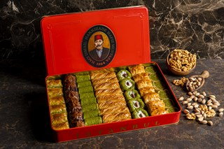
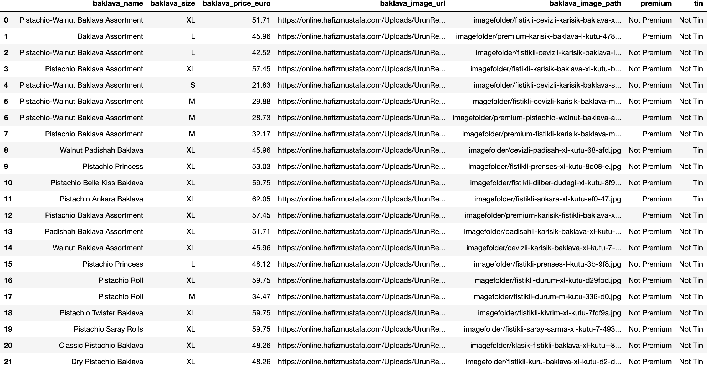
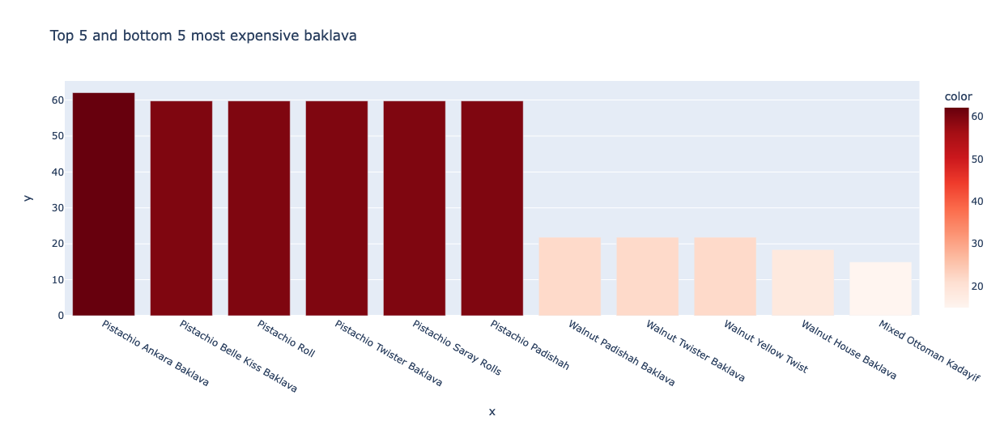

`Python`, `Webscraping`,`Pandas`, `Plotly`, `Data Cleaning`, `Data Visualizations`, `Basic Statistics`, `Interactive plots` 

# Webscraping project - With data cleaning and visualization

This personal project is made to understand and learn how data can be scraped from a website. Baklava is a very delicious turkish dessert, and I really like 
baklava. I therefore decided to webscrape [Hafız Mustafa](https://online.hafizmustafa.com/baklava-en), which is a baklava brand, which in my opinion makes 
the best baklava. The following three images are respectively a webscraped baklava image from the website, the sub-dataset (the whole dataset contain 64 rows) 
I have created by scraping data from the website and cleaning it with Pandas and an interactive visualization made with Plotly.

<br>
<p align="center">  </p>
<br>

<br>
<p align="center">  </p>
<br>

<br>
<p align="center">  </p>
<br>

## 1.) Webscraping
So we start first with scraping the data from this [website](https://online.hafizmustafa.com/baklava-en).

### 1.1) Import relevant libraries

<br>

<details>
<summary>Click to see the libraries</summary>

```python
# Relevant Libraries 
from bs4 import BeautifulSoup
import requests
import csv
```

</details>

<br>

### 1.2) Fetch content from website
```python
# By this code we fetch the content from the URL given
hafizoglu_baklava_url = 'https://online.hafizmustafa.com/baklava-en'
source = requests.get(hafizoglu_baklava_url).text
soup = BeautifulSoup(source, 'lxml')
```
### 1.3) Prepare the CSV file

```python
# These lines are to prepare for storing the scraped data to a csv file
csv_file = open('baklava_scrape.csv', 'w')
csv_writer = csv.writer(csv_file)
csv_writer.writerow(['baklava_name', 'baklava_size', 'baklava_price','baklava_image_url']) # The headers
```

### 1.4) Start scraping

```python
# We first find the header of the data to all the products in the website's HTML by inspecting the website 
match = soup.find("div", {"id": "ProductPageProductList"}) 

# Used to store the url to the images in the website as seen at the very top image.  
base_url = 'https://online.hafizmustafa.com'

# I found out that 'ItemOrj col-lg-3 col-md-3 col-sm-6 col-xs-6' was a class for all products, which mean
# I can loop over all the products, because of using find_all method.
for product in match.find_all('div',class_ = 'ItemOrj col-lg-3 col-md-3 col-sm-6 col-xs-6'):

    full_name = product.find('div',class_= 'productName detailUrl') # First we find the name by this class
    full_name = full_name.a.text                                    # Doing this gave us the full name of the baklava product

# All these lines of code are used to split the size from the full name, to store the size for it self in the csv file
    try:
        full_name1 = full_name.split('(')
        baklava_name = full_name1[0]
        baklava_size = full_name1[1]
    except Exception as e:
        baklava_size = None
        baklava_name = full_name

    print(baklava_name)
    print(baklava_size)


    price = product.find('div', class_ = 'discountPrice').span.text   # We found the class to the price by this line
    print(price.strip())                                            

    website_src = product.find('div', class_ = 'productImage').a.img['src'].  # Here we found the source to the image on the website, but some of
    if website_src == '/Uploads/Images/load.gif':                             # them wasn't store there as well.
        website_src = product.find('div', class_ = 'productImage').a.img['data-original'] # Therefore we added this condition to get all the sources to image
    image_url = base_url + website_src
    print(image_url)
    print()
    csv_writer.writerow([baklava_name,baklava_size,price,image_url])          # Here we did store all the scraped data into a CSV file

csv_file.close()

```
## 2.) Store all the images from URL into computer

### 2.1) Import relevant libraries and load data

<br>

<details>
<summary>Click to see the libraries</summary>

```python
# Import relevant libraries
import numpy as np
import pandas as pd
import requests
import shutil

import matplotlib.pyplot as plt
import seaborn as sns
sns.set_style("whitegrid")

from IPython.display import display, HTML
display(HTML("<style>.container { width:78% !important; }</style>"))

# Load scraped data
df = pd.read_csv('baklava_scrape.csv')
```

</details>

<br>   

### 2.2) Store all images from URL into computer and add the path to dataframe


  ```python
  # Convert from url to jpg image on computer
  for url in df['baklava_image_url']:
      img_data = requests.get(url).content
      image_name = url.split("thumb/")[1]
      with open(image_name, 'wb') as handler:
          handler.write(img_data)
          current_dir = image_name
          move_to = f'./imagefolder/{image_name}'
          shutil.move(current_dir,move_to)

  # Add all path for the image on the repository
  base = 'imagefolder/'
  baklava_path = []
  for url_jpg in df['baklava_image_url']:
      baklava_path.append(base + url_jpg.split('thumb/')[1])

  df['baklava_image_path'] = baklava_path
  ```

### 2.3) The status of the dataframe soo far

<br>

<details>
<summary>Click to see the dataframe</summary>


